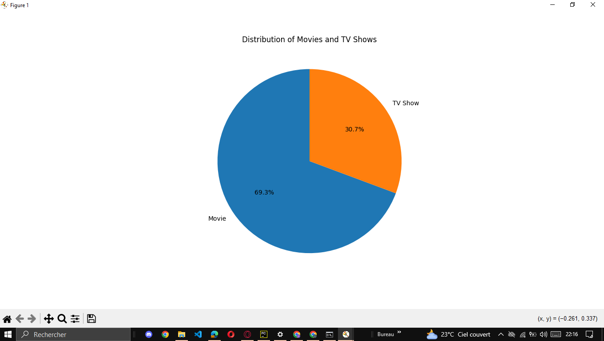
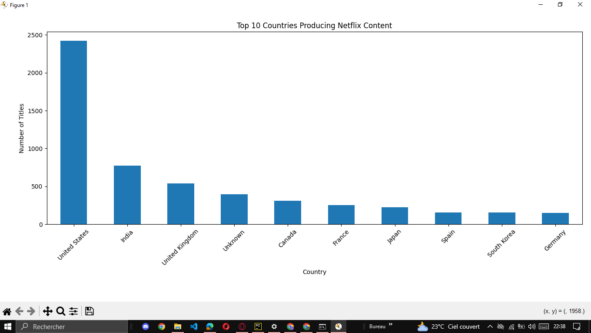
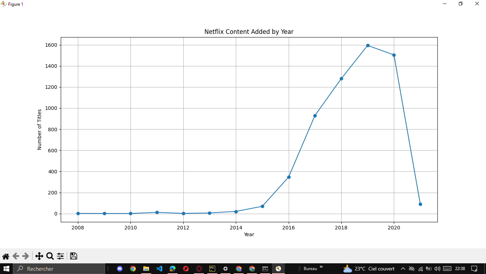

# Netflix Data Analysis

Netflix data analysis and visualization using Python, Pandas, NumPy and Matplotlib.

## 📌 Project Description

This project focuses on cleaning, analyzing and visualizing a Netflix dataset.

The goal is to explore the content available on Netflix and extract useful information about movies, TV shows, countries, ratings, genres and content added over the years.

## 🛠️ Technologies

* Python
* Pandas
* NumPy
* Matplotlib

## 🧹 Data Cleaning

The dataset was cleaned by:

* Removing duplicate rows
* Handling missing values
* Replacing missing values with `Unknown`
* Converting `date_added` to datetime format
* Removing invalid dates

## 📊 Data Analysis

The project analyzes:

* Movies vs TV Shows
* Top countries producing Netflix content
* Netflix content added by year
* Most common ratings
* Most common genres
* Movies vs TV Shows by year
* Content by release year

## 📈 Visualizations

### 1. Movies vs TV Shows



### 2. Top 10 Countries



### 3. Netflix Content Added by Year



## 📁 Project Structure

```text
Netflix-Data-Analysis/
│
├── NetFlix.csv
├── netflex_analysis.py
├── diagramme1.png
├── diagramme2.png
├── diagramme3.png
└── README.md
```

## 🎯 Objective

This project was created as a practical exercise to improve skills in:

* Data cleaning
* Data analysis
* Data visualization
* Python
* Pandas
* NumPy
* Matplotlib

```

**ملاحظة مهمة:** إلا كان `NetFlix.csv` كبير بزاف، من الأفضل نتأكدوا من الحجم قبل ما نرفعوه لـ GitHub. أما `.idea` فـ **ما نرفعوهاش**.
```
